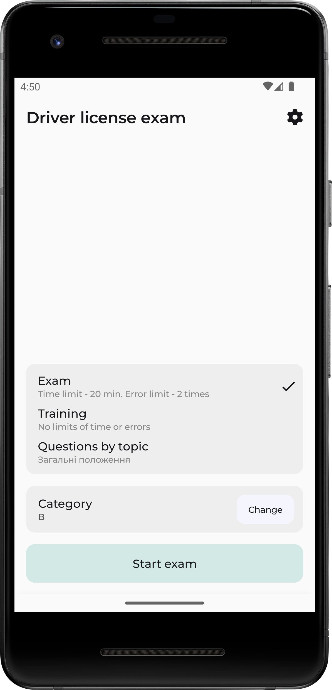
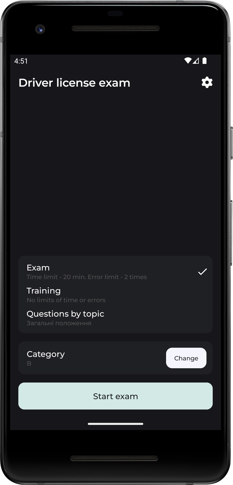
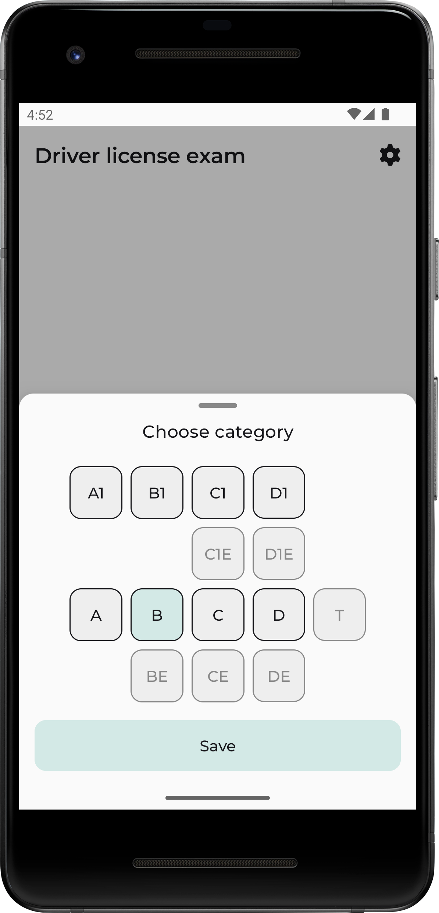
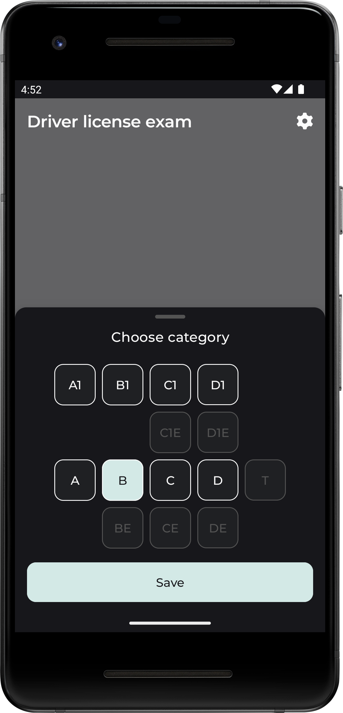
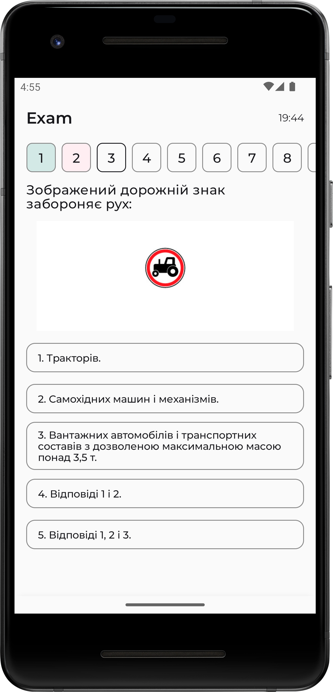
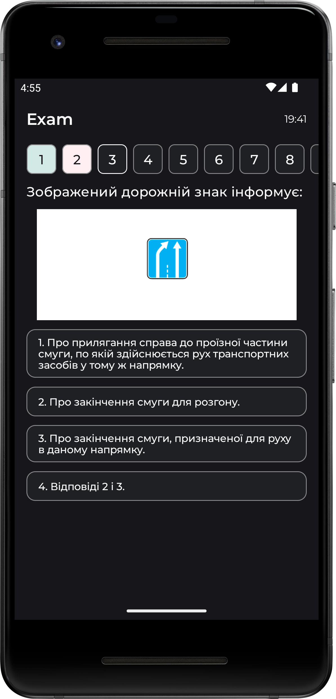
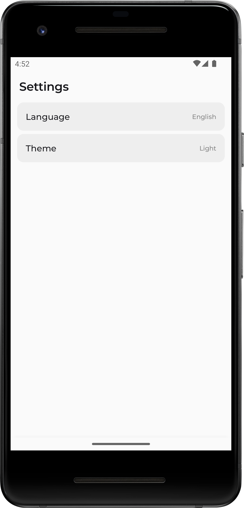
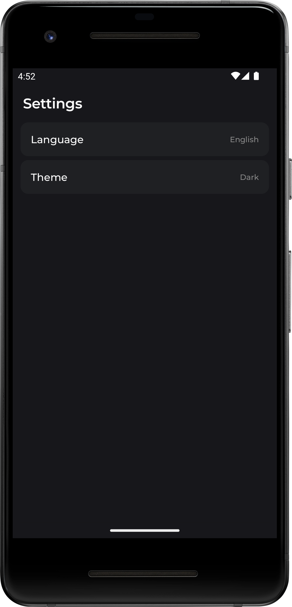

# Driver license exam

The application provides an opportunity to test your knowledge of traffic rules in order to pass a driver's license exam.

## Home Screen

Oh the home screen we can see selected categories and exam mode selector.

Exam mode selector has 3 states:
* Exam;
* Training;
* Questions by topic;

 

## Category Selector

Category selector opens from the home screen. A few categories can be chosen. Questions selection algorithm depends on chosen categories.

 

## Exam Screen

Chosen mode and countdown timer displays at the top of Exam screen. The name of topic displays for "Questions by topic" mode.

 

## Settings Screen

The language and the application theme can be changed in the settings screen.

 
